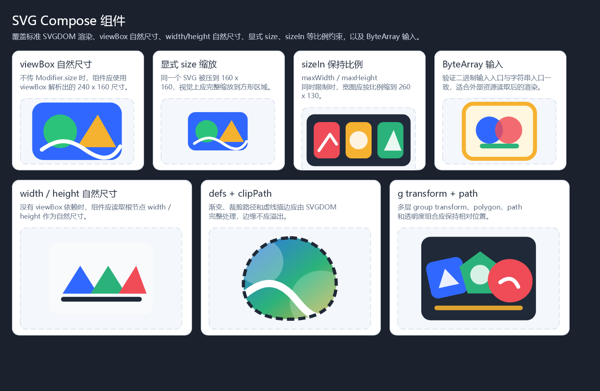
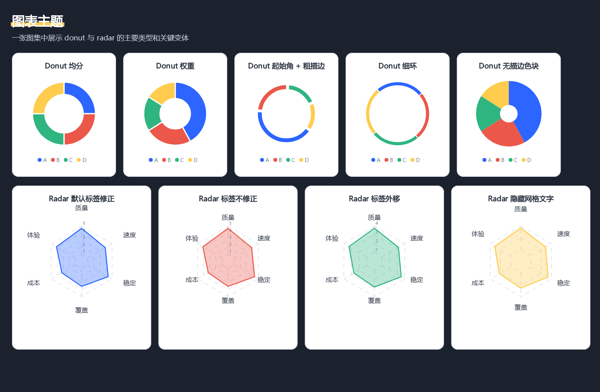

# Tavolo

`Tavolo` 读作 `TAH-vo-lo`，来自 Esperanto，含义为“图层”。这里取“承载图像处理、绘制、编码和渲染能力的工作台”这一层含义。

基于[skiko](https://github.com/JetBrains/skiko)的绘图工具库, 包括

- [gif编码](gif-codec/src/main/kotlin/gif)(参考[cssxsh/mirai-skia-plugin](https://github.com/cssxsh/mirai-skia-plugin))
- [图片逐帧处理框架](gif-codec/src/main/kotlin/frame)
- [compose语法生成图片](graphics/src/main/kotlin)
- [图片滤镜/特效](core/src/main/kotlin/handler/list)
- [基于输入图片生成表情](core/src/main/kotlin/handler/face)
- [基于输入生成图片](core/src/main/kotlin/generator/list)
- [bdf点阵字体解析](bdf-parser/src/main/kotlin)
- [HTTP 指令服务](http-server)

## 渲染示例

这些示例图片由 `graphics` 模块的 Compose DSL 人工测试生成，适合快速了解 Tavolo 在图片布局、SVG、图表和视觉效果上的能力。

### 标准 SVG 组件



对应 Compose 语法：

```kotlin
val badgeSvg = """
    <svg xmlns="http://www.w3.org/2000/svg" viewBox="0 0 240 160">
        <rect x="8" y="8" width="224" height="144" rx="28" fill="#3068ff"/>
        <circle cx="78" cy="80" r="42" fill="#2bc37a"/>
        <path d="M120 120 L172 38 L218 120 Z" fill="#f5b130"/>
    </svg>
"""

render(Color.TRANSPARENT) {
    column(modifier = Modifier.padding(30f).background(Color.makeRGB(27, 34, 46))) {
        text("SVG Compose 组件", fontSize = 31f, textColor = Color.WHITE)

        row(modifier = Modifier.padding(top = 24f)) {
            svg(badgeSvg)
            svg(
                badgeSvg.encodeToByteArray(),
                Modifier.sizeIn(maxWidth = 260f, maxHeight = 190f)
            )
        }
    }
}
```

### Modifier 视觉效果


对应 Compose 语法：

```kotlin
box(
    modifier = Modifier
        .size(220f, 140f)
        .shadow(
            blurRadius = 18f,
            color = Color.makeARGB(90, 29, 37, 56),
            offsetY = 10f,
            shape = Shape.RoundedRect(24f)
        )
        .rotate(-6f)
        .clip(Shape.RoundedRect(24f))
        .background(Color.makeRGB(48, 104, 255))
        .border(
            4f,
            Color.WHITE,
            StrokeStyle.Dashed(listOf(14f, 8f)),
            shape = Shape.RoundedRect(24f)
        )
        .padding(18f),
    horizontalAlignment = HorizontalAlignment.Center,
    verticalAlignment = VerticalAlignment.Center
) {
    text("clip + shadow", textModifier = TextModifier.font(22f, Color.WHITE, uiFont))
}
```

### 图表组件



对应 Compose 语法：

```kotlin
render(Color.makeRGB(24, 28, 34)) {
    row(modifier = Modifier.padding(24f), verticalAlignment = VerticalAlignment.Center) {
        bar(
            BarTheme(outerRadius = 90f),
            listOf(
                Color.makeRGB(72, 149, 239) to 42f,
                Color.makeRGB(247, 127, 0) to 28f,
                Color.makeRGB(76, 175, 80) to 30f,
            )
        )

        radar(
            RadarTheme(width = 360f, height = 260f, radius = 90f),
            listOf("布局" to 0.82f, "文本" to 0.74f, "SVG" to 0.9f, "图表" to 0.86f)
        )
    }
}
```

## 设计文档

- [快速开始](docs/快速开始.md)
- [指令资源与能力注册设计](docs/指令资源与能力注册设计.md)
- [HTTP 指令服务设计](docs/HTTP指令服务设计.md)
- [Compose 绘图 DSL 与渲染抽象设计](docs/Compose绘图DSL与渲染抽象设计.md)
- [TODO](docs/TODO.md)

## 引入依赖

版本请在[release](https://github.com/4o4E/Tavolo/releases)中查看

```kotlin
val version = "2.0.0-SNAPSHOT"

repositories {
    maven("https://nexus.e404.top:3443/repository/maven-snapshots/")
}

dependencies {
    implementation("top.e404.tavolo:tavolo-core:${version}")
    implementation("top.e404.tavolo:tavolo-graphics:${version}")
    implementation("top.e404.tavolo:tavolo-gif-codec:${version}")
    implementation("top.e404.tavolo:tavolo-common:${version}")
}
```
