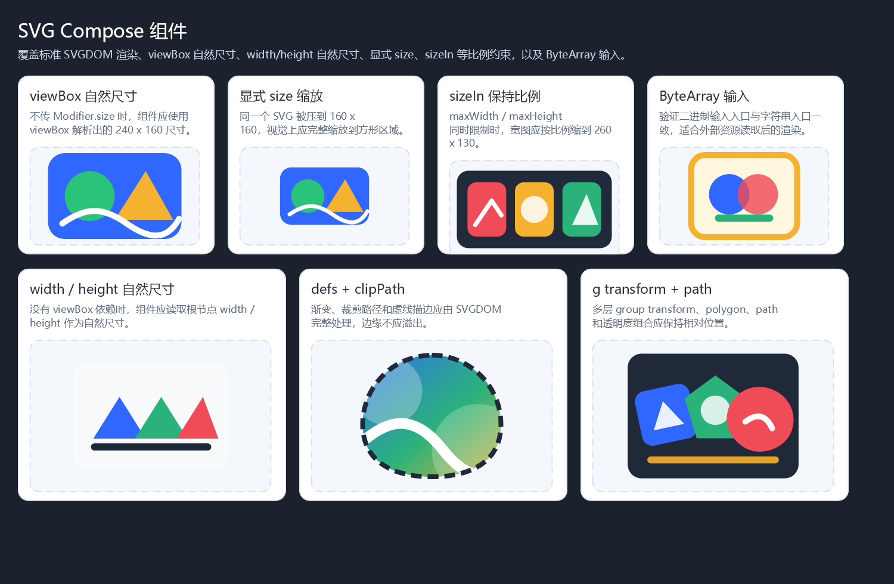
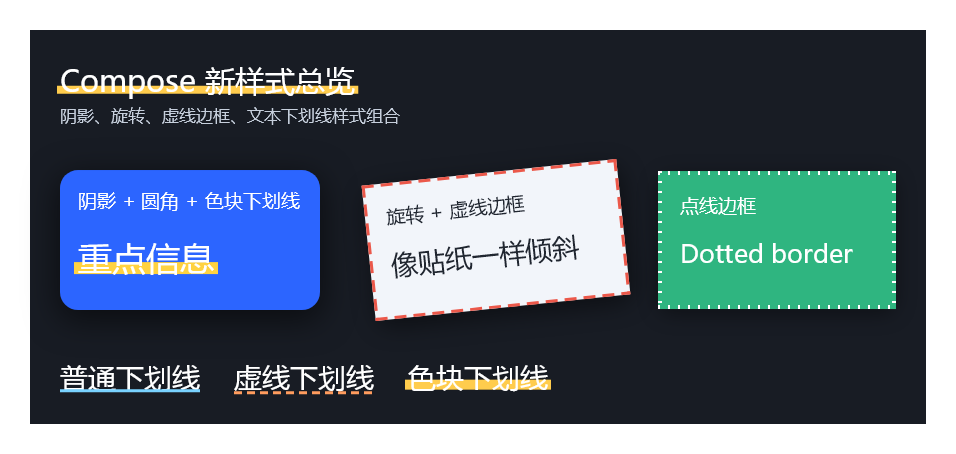
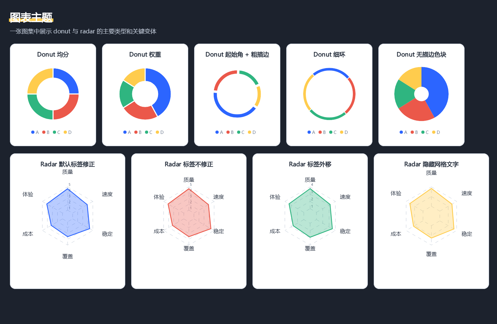

# Tavolo

[English](README_EN.md) | 简体中文

`Tavolo` 读作 `TAH-vo-lo`，来自 Esperanto，含义为“图层”。

## 项目目标

Tavolo 的目标是在没有显示输出的服务器环境中完成图片处理和离线渲染。
它不依赖桌面窗口或交互式画布，而是把输入数据、字体、图片资源和绘图 DSL 渲染成图片。
核心渲染能力基于 [Skiko](https://github.com/JetBrains/skiko)。

适合的场景包括：

- 在 headless server 中生成静态图片、卡片、图表和 SVG 混排内容。
- 对图片或 GIF 做离线逐帧处理，生成表情、滤镜和动态图效果。
- 通过 HTTP 服务暴露图片处理指令，供机器人或业务系统调用。
- 解析 BDF 点阵字体，服务于点阵文字和像素风图片生成。

## 模块概览

| 模块 | 作用 |
| --- | --- |
| [`graphics`](graphics/src/main/kotlin) | Compose 风格绘图 DSL，支持布局、文本、图片、SVG、图表、Modifier 效果和 3D 渲染。 |
| [`gif-codec`](gif-codec/src/main/kotlin) | GIF 编解码和逐帧处理框架，部分实现参考 [`cssxsh/mirai-skia-plugin`](https://github.com/cssxsh/mirai-skia-plugin)。 |
| [`core`](core/src/main/kotlin) | 图片处理指令、表情生成器和输入驱动的图片生成能力。 |
| [`bdf-parser`](bdf-parser/src/main/kotlin) | BDF 点阵字体解析。 |
| [`http-server`](http-server) | HTTP 指令服务，封装命令查询和图片执行接口。 |
| [`http-client`](http-client) | HTTP 指令服务客户端。 |

## 渲染预览

示例图片由 `graphics` 模块的人工测试生成。README 只保留一个最小可读示例；复杂示例直接链接到对应人工测试源码，避免图片和简化代码不一致。

### Hello World


对应人工测试：[`ComposeHelloWorldManualTest.kt`](graphics/src/manualTest/kotlin/ComposeHelloWorldManualTest.kt)

<details>
<summary>查看对应 Compose 代码</summary>

```kotlin
val uiFont = ManualTestSupport.uiFont

ManualTestSupport.saveCompose("README-01-Hello-World") {
    box(
        modifier = Modifier
            .size(860f, 360f)
            .background(Color.makeRGB(26, 34, 48))
            .padding(42f)
    ) {
        column(
            modifier = Modifier
                .background(Color.makeRGB(255, 255, 255))
                .padding(36f)
        ) {
            text(
                "Hello, World!",
                fontSize = 56f,
                textColor = Color.makeRGB(38, 58, 92),
                fontFamily = uiFont
            )
            text(
                "Tavolo Compose DSL",
                modifier = Modifier.padding(top = 18f),
                fontSize = 28f,
                textColor = Color.makeRGB(87, 103, 128),
                fontFamily = uiFont
            )
        }
    }
}
```

</details>

### 更多示例

#### 标准 SVG 组件



源码：[`ComposeSvgManualTest.kt`](graphics/src/manualTest/kotlin/ComposeSvgManualTest.kt)

#### Modifier 视觉效果



源码：[`ComposeEffectManualTest.kt`](graphics/src/manualTest/kotlin/ComposeEffectManualTest.kt)

#### 图表组件



源码：[`ComposeThemeManualTest.kt`](graphics/src/manualTest/kotlin/ComposeThemeManualTest.kt)

## 引入依赖

版本请在 [Release](https://github.com/4o4E/Tavolo/releases) 中查看。正式版本发布到 Maven Central，`-SNAPSHOT` 预览版本发布到 Sonatype snapshot 仓库。

然后在项目中引入依赖：

```kotlin
val version = "2.5.0"

repositories {
    mavenCentral()
    // 仅在使用 -SNAPSHOT 版本时需要。
    maven("https://central.sonatype.com/repository/maven-snapshots/")
}

dependencies {
    implementation("top.e404.tavolo:tavolo-core:${version}")
    implementation("top.e404.tavolo:tavolo-graphics:${version}")
    implementation("top.e404.tavolo:tavolo-gif-codec:${version}")
    implementation("top.e404.tavolo:tavolo-common:${version}")
}
```

## 字体引入

文本渲染前需要先注册字体，`fontFamily` 接收的是 `FontManager` 中的字体名，不是字体文件路径。`graphics` 模块已经通过 `api` 暴露 `common` 模块，使用 `tavolo-graphics` 时可以直接引入 `FontManager`。

### 方案一：使用系统字体

适合桌面程序、Windows 服务，或已经明确安装目标字体的机器。系统字体名需要以运行机器实际可见的 family 名称为准。

```kotlin
import top.e404.tavolo.util.FontManager

val uiFont = FontManager.registerSystem("ui", "Microsoft YaHei")
FontManager.registerSystem("emoji", "Segoe UI Emoji")
FontManager.defaultFamily = uiFont
```

### 方案二：Docker 容器直接映射系统字体

Docker 容器不会自动继承宿主机字体；如果要复用宿主机字体，需要把宿主机字体目录只读挂载到容器内，再按容器内路径注册字体。

```powershell
docker run --rm `
  -v C:\Windows\Fonts:/host-fonts:ro `
  your-image
```

```kotlin
import top.e404.tavolo.util.FontManager
import java.io.File

val uiFont = FontManager.registerFile("ui", File("/host-fonts/msyh.ttc"))
FontManager.registerFile("emoji", File("/host-fonts/seguiemj.ttf"))
FontManager.defaultFamily = uiFont
```

Linux 宿主机可以把 `/usr/share/fonts` 或业务字体目录挂载到容器内，容器里的注册代码保持同样模式。

### 方案三：使用 data 目录

适合随应用包分发一组固定字体，并使用 common 模块里的预置字体名。把字体文件放到 `TavoloFonts.fontDir` 指向的目录，默认目录为 `data/font`。

例如使用 `TavoloFonts.LW` 时，需要准备 `data/font/LXGWWenKai-Regular.ttf`：

```kotlin
import top.e404.tavolo.TavoloFonts
import top.e404.tavolo.util.FontManager

TavoloFonts.fontDir = "data/font"
val uiFont = TavoloFonts.register(TavoloFonts.LW)
FontManager.defaultFamily = uiFont
```

### 方案四：手动注册字体

适合业务自带品牌字体、租户级字体，或运行时从文件、字节流加载字体。手动注册后，业务代码仍然只通过返回的字体名引用。

```kotlin
import top.e404.tavolo.util.FontManager
import java.io.File

val titleFont = FontManager.registerFile("brand-title", File("font/BrandTitle.ttf"))
val fontBytes = File("font/TenantBody.ttf").readBytes()
val bodyFont = FontManager.registerBytes("tenant-body", fontBytes)

text(
    "Tavolo",
    fontSize = 36f,
    fontFamily = titleFont
)
text(
    "业务字体",
    fontSize = 20f,
    fontFamily = bodyFont
)
```

## 本地验证

请先确保本机已安装并配置 Java 17 或更高版本。Tavolo 发布产物仍保持 Java 11 运行兼容。

常规测试：

```shell
./gradlew test
```

只生成 README 的 Hello World 示例图：

```shell
./gradlew :graphics:manualTest --tests "*ComposeHelloWorldManualTest"
```

人工测试输出位于 `run/out`。

## 文档入口

- [快速开始](docs/快速开始.md)
- [人工测试说明](docs/人工测试说明.md)
- [Compose 绘图 DSL 与渲染抽象设计](docs/Compose绘图DSL与渲染抽象设计.md)
- [3D 渲染实现设计](docs/3D渲染实现设计.md)
- [指令资源与能力注册设计](docs/指令资源与能力注册设计.md)
- [HTTP 指令服务设计](docs/HTTP指令服务设计.md)
- [TODO](docs/TODO.md)
- [下游升级到 2.5.0：emoji 字体回退](docs/下游升级到2.5.0-emoji回退.md)

## 许可证

Tavolo 使用 [Apache License 2.0](LICENSE) 开源，出处声明见 [NOTICE](NOTICE)。
